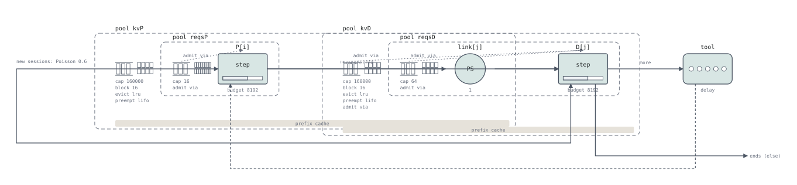

# Case study: prefill/decode disaggregation over NIXL

`examples/pd-disaggregation/llmd_pd.seq` is llm-d's prefill/decode split on vLLM: the router
that decides which pod prefills and which decodes, the sidecar that sends
the prompt to one and the decode request to the other, and the two
schedulers that hand the KV over with the NIXL connector. Every line is
checked against the source: llm-d at `8a2f37d`, its router
(`llm-d-inference-scheduler`) at `13eebdb`, vLLM at `0c87a197` (`ref/vllm`;
the vLLM citations are hashed by `make check`, the llm-d ones are not).

It is a specification checked against the code, not yet against a
scheduler oracle. What the program cannot say without two new statements,
and what it still cannot say, is in [The KV transfer](design/pd-transfer.md).



The prompt's KV is in the prefiller's pool through the transfer and in the
decoder's from the transfer on, which is why the two enclosures cross at the
link.

## The deployment

llm-d's P/D guide (`guides/pd-disaggregation`, llm-d `8a2f37d`) deploys
this:

| Piece | Configuration | Where |
|---|---|---|
| model servers | 8 prefill pods (`vllm serve`, TP 1) and 2 decode pods (TP 4), gpt-oss-120b, `--block-size 128`, `--kv-transfer-config '{"kv_connector":"NixlConnector","kv_role":"kv_producer" / "kv_consumer","kv_connector_extra_config":{"backends":["UCX"]}}'`, `VLLM_NIXL_SIDE_CHANNEL_HOST` the pod IP | `modelserver/gpu/vllm/base/patch-prefill.yaml`, `patch-decode.yaml` |
| router (EPP) | `disagg-profile-handler` with `always-disagg-pd-decider` (every request is prefilled remotely); decode profile `decode-filter` → `active-request-scorer` → `max-score-picker` (the least busy decoder); prefill profile `prefill-filter` → `prefix-cache-affinity-filter` (`approx-prefix-cache-producer`, a cache-warm prefiller first) → `token-load-scorer` → `max-score-picker`; one EPP replica | `router/pd-disaggregation.values.yaml` |
| sidecar | `llm-d-routing-sidecar` on each decode pod, connector `nixlv2`: prefill leg (`max_tokens = 1`, `do_remote_decode`), wait, decode leg with the prefiller's block ids; serial | `pkg/sidecar/proxy/connector_nixlv2.go` (router `13eebdb`) |
| alternative decider | `prefix-based-pd-decider` with `nonCachedTokens`, `promptTokens`: remote prefill only when the uncached suffix on the chosen decoder is long enough | `docs/disaggregation.md`, `profilehandler/disagg/README.md` |

The examples below run on one prefiller or two, one decoder or two, with Qwen3-8B
and block 16. What differs from the guide is written next to each number.

## In seQ

```seq title="examples/pd-disaggregation/llmd_pd.seq"
--8<-- "examples/pd-disaggregation/llmd_pd.seq"
```

### Line by line

#### The router and the sidecar, against llm-d

| llm-d | seQ | Where |
|---|---|---|
| the endpoint picker runs the decode profile first and picks a decode pod; the guide's decode profile scores by active requests (the least busy) | `choose j in ND by (holders(kvD[j]) + queued(kvD[j]))` | `disagg_profile_handler.go:316-334`; `guides/pd-disaggregation/router/pd-disaggregation.values.yaml` |
| the decider: a remote prefill when the prompt's uncached suffix on the chosen decode pod is at least `nonCachedTokens`, and the prompt at least `promptTokens`; the cached part is the router's own estimate of the pod's prefix cache | `set hitD = min(cachedin(kvD[j]), hitmax); set remote = prompt >= minp && prompt - hitD >= thr;` | `prefix_based_pd_decider.go:266-303`; `disagg_profile_handler.go:353-366`. The guide runs `always-disagg-pd-decider`, which is `thr = 1` |
| the prefill profile: pods that have the prefix (`prefix-cache-affinity-filter`), then the least loaded (`token-load-scorer`) | `choose i in NP by ((cachedin(kvP[i]) > 0 ? 0 : 1) * 1e9 + work(P[i]) + queued(reqsP[i]))` | the same values file |
| the decode pod's sidecar sends the prompt to the prefiller with `max_tokens = 1` and `do_remote_decode`, waits for the answer, then sends the decode request to its own engine with the prefiller's block ids | the prefiller's hold, its blocks leased at its end, then the decoder's hold | `connector_nixlv2.go:69-232` (the prefill leg, `CapSingleToken` at 145), `261-379` (the decode leg) |
| no prefill header: the request goes to the decode pod's engine as it is | the `else` branch: vLLM's engine on one device (`examples/multi-turn/vllm.seq`) | `dispatch.go:196-213` |
| the two legs in parallel, so the decoder allocates while the prefiller works | not written: a session waits at one pool at a time ([The KV transfer](design/pd-transfer.md)) | `connector_nixlv2.go:60-67` (MoRI-IO write mode only); vLLM's push-mode proxy, `disagg_proxy_pushconnector_demo.py:227-270` |

#### The two schedulers, against vLLM

| vLLM | seQ | Where |
|---|---|---|
| the prefiller admits like any vLLM engine: a slot, the blocks of the first chunk, room for the whole prompt, the prefix hit looked up when the scheduler takes the request | `admit if reqsP[i] (1), kvP[i] (min(prompt, hit + budget_left(P[i]))) reserve (prompt) fit where hit = …` | the waiting loop, `scheduler.py:868-1128`; [the vLLM case study](case-study-vllm.md) |
| the prefiller computes the prompt in chunks and samples one token, which the sidecar discards | `prefill on P[i] (prompt - c) growing kvP[i]` | `scheduler.py:624-823`; the truncation for Mamba and MTP only, `nixl/base_scheduler.py:409-436` |
| the request finishes on the prefiller: its slot is freed, its blocks are not — `request_finished` returns `delay_free_blocks` and a lease of `kv_lease_duration` (30 s), renewed by the decoder's heartbeats while the request waits | `} keep (prompt) lease kvP[i] (inf);` — the scope ends, the slot goes, the blocks stay the session's | `nixl/pull_scheduler.py:191-292`; `_free_request`, `scheduler.py:2628-2657`; the renewal, `nixl/base_scheduler.py:199-238`, `nixl/base_worker.py:3010-3030` |
| the prefiller keeps every computed full block of the prompt cached once the lease ends | `keep (prompt)` on that hold, applied when the lease ends | `_connector_finished`, `scheduler.py:2929-2982`; `kv_cache_manager.py:610-619` |
| the decoder's scheduler looks at its waiting queue only at a step with budget left and a running slot free | `admit via D` on both of the decoder's pools; `reqsD[j] (0) reserve (1)` — a slot must be free, none is taken | `scheduler.py:872-879` |
| the decoder's local prefix hit, then the connector: for a remote prefill every prompt token beyond the local hit is external and loaded asynchronously | `kvD[j] (known) reserve (known)` with `reuse (floor((known - 1) / bs) * bs)`; `c = cached` is the local hit | `scheduler.py:932-954`; `nixl/pull_scheduler.py:34-66` |
| blocks are allocated for the whole prompt, and the request is parked, `WAITING_FOR_REMOTE_KVS`, holding them and no slot; one transfer per request | the hold on `kvD[j]`; `transferred` is `do_remote_prefill`, spent | `scheduler.py:1199-1226, 1264-1294`; `nixl/pull_scheduler.py:108-189` |
| the worker reads the blocks from the prefiller over NIXL (pull mode: a NIXL READ issued by the decoder) | `transfer[j] (x0 + (prompt - c) / Bw) from kvP[i] to kvD[j] (prompt - 1 - c)` on the decoder's link | `nixl/pull_scheduler.py:168-177`; the worker's `_read_blocks`, `nixl/pull_worker.py:392-575` |
| the read done, the blocks are cached, the last prompt token is marked uncomputed (its logits are needed), and the request is back in the waiting queue, served before new arrivals | `load kvD[j] (prompt - 1 - c)` inside the transfer; `admit if reqsD[j] (1) fit`, with `reqsD` declared before `kvD` | `_update_waiting_for_remote_kv`, `scheduler.py:3032-3077`; `_try_promote_blocked_waiting_request`, `scheduler.py:3079-3092`; `scheduler.py:2383-2385` |
| the prefiller frees the leased blocks when the read completes | `release kvP[i]` inside the transfer takes the lease | `_update_from_kv_xfer_finished`, `scheduler.py:3113-3138` |
| the decoder recomputes the last prompt token and decodes; a request preempted afterwards is rescheduled without a second transfer, prefilling locally what it lost | `prefill on D[j] (known - c) growing kvD[j]; decode on D[j] (o - 1 - (known - prompt)) growing kvD[j];` with `known` from `computed` | `scheduler.py:1560-1561`; `nixl/pull_scheduler.py:187-189` |
| a parked request is in no `running` list and is not preempted; nor is the prefiller's finished one | `preempt lifo` takes the last admitted *resident* of the engine | `scheduler.py:742-813` |
| the decoder keeps the prompt's and the output's full blocks cached | `} keep (prompt + o)` | `kv_cache_manager.py:602-606` |

### Writing xPyD

The deployment is families: `NP` prefill instances and `ND` decode
instances, each with its own KV pool, request-slot pool, engine and NIC.

```
pool reqsP[2] { cap max_seqsP; admit via P; }
pool kvP[2]   { cap blocksP * bs; block bs; evict lru; preempt lifo; }
pool reqsD[2] { cap max_seqsD; admit via D; }
pool kvD[2]   { cap blocksD * bs; block bs; evict lru; preempt lifo; admit via D; }

stage P[2] : step { budget B; cost …; memory kvP; }
stage D[2] : step { budget B; cost …; memory kvD; }
stage link[2] : ps(1);
```

A family of `N` written next to a family of `N` is joined member for
member: `admit via P` on `reqsP[2]` means `reqsP[i]` is served by `P[i]`,
and `memory kvP` on `P[2]` means `P[i]` counts `kvP[i]` as its residents'
memory (`kvb`, `kvp`). Next to a family of one, every member gets that one;
any other pair of counts is a link error. A family's size is a literal
(`[2]`), so the router's `choose j in ND` and the declarations carry the
same number twice; a mismatch shows up as an index out of range at the
first `choose`.

The router is the session's two `choose`s, and the instance it picked is
carried by the index everywhere after: `admit if reqsP[i] (1), kvP[i]
(…)`, `prefill on P[i] … growing kvP[i]`, `lease kvP[i]`, `transfer[j] …
from kvP[i] to kvD[j]`, `admit if kvD[j] …`, `decode on D[j] … growing
kvD[j]`. `release` and `load` (and so `transfer … from … to …`) name the
pool exactly as the hold that took it did, index included; `hold kvP[i] …
lease kvP[i]` followed by `transfer … from kvP[k]` does not link. The
serving forms take the family index before the work: `prefill on P[i] (…)`
for a step engine that has to be named, `transfer[j] (…)` for the role's
own stage array (`link`).

Going from 2P2D to 4P8D is the four literals and the two `let`s; the
program does not change otherwise, which is the point of writing the router
as `choose` over a family rather than as a branch per instance
(`examples/multi-turn/routing.seq` still has the branch-per-policy shape the design
notes call a smell).

### The two modes

**Pull** (`NixlConnector`, `kv_role` producer and consumer): the decoder
reads. The prefiller must be done before the decoder can be told where the
blocks are, so the sidecar's dispatch is serial: prefill leg, answer, decode
leg. The program above is this mode, on the llm-d guide's deployment
(`guides/pd-disaggregation/modelserver/gpu/vllm/base/patch-decode.yaml`).

**Push** (`NixlPushConnector`): the decoder allocates and registers its
block ids with the prefiller over a NIXL notification
(`nixl/push_scheduler.py:128-205`); the prefiller writes the KV when it has
both a finished request and its registration (`nixl/push_scheduler.py:207-294`)
and frees the lease when the write completes (`nixl/push_scheduler.py:342-357`).
The decoder needs nothing from the prefiller's answer, so the two legs can
be sent at once, and vLLM's push-mode proxy does
(`disagg_proxy_pushconnector_demo.py:227-270`): the decoder allocates *during*
the prefill and the write starts the moment it ends. Through the llm-d
sidecar the dispatch is serial for NIXL (parallel for MoRI-IO only,
`connector_nixlv2.go:60-67`), and then the two modes have the same
lifecycle: the same holds in the same order, the copy moved by the
prefiller's worker instead of the decoder's, one notification more.

#### The two modes in the program

Pull is the program as written. The prefiller's scope ends in a lease, the
decoder is admitted, and the decoder's NIC does the copy:

```
admit if reqsP[i] (1), kvP[i] (…) fit … { prefill on P[i] (…) growing kvP[i]; } keep (prompt) lease kvP[i] (inf);
admit if kvD[j] (known) reserve (known), reqsD[j] (0) reserve (1) fit … {
  transfer[j] (x0 + (prompt - c) / Bw) from kvP[i] to kvD[j] (prompt - 1 - c);   // the decoder's link[j] READs; the lease ends
  admit if reqsD[j] (1) fit { … }
} keep (prompt + o);
```

Push through the llm-d sidecar (serial dispatch) is the same three lines
with two differences a reader can see: the copy is the prefiller's WRITE,
so it runs on the prefiller's NIC, and it starts one notification after the
decoder's admission (the registration, `nixl/push_scheduler.py:128-205`):

```
stage linkP[2] : ps(1);                                   // the prefillers' NICs
…
admit if kvD[j] (known) reserve (known), reqsD[j] (0) reserve (1) fit … {
  transfer on linkP[i] (x0 + x_reg + (prompt - c) / Bw) from kvP[i] to kvD[j] (prompt - 1 - c);
  admit if reqsD[j] (1) fit { … }
} keep (prompt + o);
```

`transfer on linkP[i] (…) from kvP[i] to kvD[j] (…)` is the same kernel
statements — `run linkP[i]; load kvD[j]; release kvP[i]` — on the other
side's stage. Which NIC saturates under load is what the two programs
differ in, and a deployment with more prefillers than decoders (or the
reverse) will show it.

Push with the two legs dispatched at once (vLLM's own push proxy) is the
form the language cannot yet write: the decoder's admission would have to
be requested when the request arrives, while the session is still queued
at the prefiller, so the write can start the moment the prefill ends. A
session waits at one pool at a time, so the program above writes the
decoder's admission after the prefill. The difference is bounded: under
decoder memory pressure both forms lease at the prefiller, since the write
cannot start before the decoder has allocated; without it, the concurrent
form takes the decoder's blocks a prefill earlier and saves one decoder
step of latency. The reservation that would write it exactly is sketched in
[The KV transfer](design/pd-transfer.md):

```
book kvD[j] (prompt) reserve (prompt);                      // join the decoder's queue now, not written yet
admit if reqsP[i] (1), kvP[i] (…) fit … { … } keep (prompt) lease kvP[i] (inf);
enter kvD[j] { transfer on linkP[i] (…) from kvP[i] to kvD[j] (…); … }   // open the booking, waiting if it is not granted
```

**Not modelled**: the lease's expiry and the decoder's heartbeats (the
lease is granted at `nixl/pull_scheduler.py:248-269`, reaped at
`nixl/base_worker.py:2982-3008`, extended by heartbeats the decoder tracks
from `nixl/base_scheduler.py:199-238`, sends at `nixl/base_worker.py:3141-3170`
and the prefiller applies at `nixl/base_worker.py:3010-3030`; they matter
only when a decoder dies);
bidirectional transfer for multi-turn (`bidirectional_kv_xfer`, the
decoder's blocks read back by the prefiller); the host buffer on
accelerators NIXL cannot read directly; tensor-parallel fan-out of the
read; cross-session prefix sharing on either side (per session here, as in
`vllm.seq`); the router's approximate prefix cache as a data structure of
its own (its estimate is taken to be the pod's cache).

## What the program predicts

Two decode pods of 160 000 tokens each, two prefill pods, sessions of
one to several turns (a prompt of 1 000–3 000 new tokens on a growing
context, 200 output tokens, a 3 s tool call between turns, `p = 0.9`), the
A100-shaped step cost of `examples/multi-turn/vllm.seq`, a 200 000 token/s link.

**The decider.** The guide's `always-disagg-pd-decider` sends every prompt
to a prefiller; the `prefix-based-pd-decider` keeps a follow-up turn whose
context the decoder already has on the decoder. At 0.6 sessions per
second:

| `thr` (nonCachedTokens) | remote prefills | mean TTFT | mean response |
|---|---|---|---|
| 1 (always) | 100 % | 46.6 ms | 90.6 ms |
| 512 | 65 % | 40.6 ms | 84.4 ms |
| 2 048 | 30 % | 39.6 ms | 83.7 ms |
| never (decode only) | 0 % | 66.0 ms | 120.1 ms |

Disaggregating everything costs a transfer per request, disaggregating
nothing costs every decoder a prefill in its decode steps, and the decider
sits between the two. With the guide's decode profile (the least busy pod,
no prefix affinity) a follow-up turn often lands on the pod that does not
have its context, and the prefiller — which does have it, through the
affinity filter — prefills the new tokens only: 65 % of requests are remote
at `thr = 512` although every first turn is a miss.

**The lease.** A finished prefill's blocks stay allocated on the prefiller
until the decoder has read them, and the decoder reads only once its own
scheduler has room for the whole prompt. Shrinking the decoders' memory
lengthens the lease and fills the prefillers (Λ = 0.6, `thr = 512`; the
prefill pool is 160 000 tokens):

| decoder memory, tokens per pod | Λ, sessions/s | remote prefills | lease, mean | prefiller memory allocated, mean of 160 000 (pod 1 / pod 2) | prefiller queue, mean | mean TTFT | sessions completed |
|---|---|---|---|---|---|---|---|
| 160 000 | 0.6 | 65 % | 21 ms | 1 800 / 400 | 0.0 | 41 ms | 1 059 |
| 32 000 | 0.6 | 91 % | 45 ms | 3 200 / 900 | 0.0 | 66 ms | 1 063 |
| 160 000 | 1.2 | 78 % | 43 ms | 6 900 / 4 400 | 0.1 | 100 ms | 2 160 |
| 32 000 | 1.2 | 95 % | 81 ms | 64 300 / 57 600 | 38.7 | 159 ms | 1 573 |

At 1.2 sessions per second the prefillers have room and compute to spare
(two of sixteen slots busy), and still their queues hold 39 requests: two
fifths of each prefiller's memory is leased to requests parked at a decoder
that has room for one or two of them. Smaller decoders also send *more*
prompts to the prefillers — they cache less, so the decider's uncached
suffix is longer — which is the other direction of the same coupling.

The decoder's shortage shows up as memory *on the prefiller*, which is the
coupling a store-and-forward program gets backwards: its prefiller holds
through the transfer and lets go before the session queues for the decoder,
so a decoder with no room costs the prefiller nothing.
`tests/pd_semantics.rs` has the deterministic version: six requests, a
decoder with room for one, a prefiller with room for two; the
store-and-forward program prefills all six at once, the NIXL program stops
after the decoder is full and the two leases have taken the prefiller.

## Why you should believe it

The claim is weaker than the [vLLM case study](case-study-vllm.md)'s, and
the difference is the point of saying so.

1. **The source, by line.** The tables above name the function for every
   statement. The vLLM ranges are hashed against `ref/vllm` at `0c87a197`
   by `make check` (`scripts/check_citations.py`), so a range that moves
   fails the build; the llm-d ranges are pinned by commit in the text only.
2. **The statements, deterministically.** `tests/pd_semantics.rs` checks
   `lease`, `release`, `load` and `transfer … from … to …` on pools of ten
   units: a leased pool stays allocated after its scope and is free the
   moment the link run ends, an untaken lease ends at its bound and keeps
   its cache, a re-executed hold releases nothing twice, the prefiller
   stops when the decoder is full.
3. **No machine.** No run of a real deployment is compared with the
   program here: the numbers under "What the program predicts" are the
   program's, not measurements.
4. **No scheduler oracle yet.** `tools/vllm_oracle.py` drives one real
   scheduler with a fake model runner. The oracle this program wants drives
   two — a producer and a consumer with a fake NIXL connector that reports a
   read complete after a chosen number of steps — and compares, per request,
   the step the decoder parks it, the step the prefiller frees its blocks
   and the decoder's first-token step. The one-block cache disagreement of
   the pull run is the first question for it.

---

See also: [The KV transfer](design/pd-transfer.md), [How seQ is checked](validation.md).
