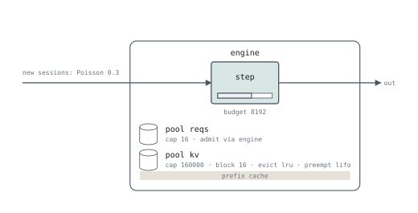

# Case study: vLLM v1 in 50 lines

`programs/vllm.seq` is vLLM v1's engine. Not "a model of" it: on six
deterministic scenarios and on a 333-session, 3 321-request trace it gives the
real scheduler's answer for **every request** — every send time, every
first-token time, every cached-token count. 3 321 of 3 321.



## The program

```rust title="programs/vllm.seq"
--8<-- "programs/vllm.seq"
```

## Line by line against the scheduler

Upstream is `ref/vllm` at `0c87a197` (`scripts/fetch_vllm_ref.sh` checks it
out).

| vLLM | seQ | Where |
|---|---|---|
| a token budget per step: running requests first in `running` order, then waiting requests with what is left | `step { budget B }`, residents in admission order | `scheduler.py:577, 624-823, 868-1128` |
| `max_num_seqs` | `pool reqs { cap max_seqs }` in the hold | `scheduler.py:877-879` |
| FCFS with head-of-line blocking (`if new_blocks is None: break`) | the pool's `fifo` queue; the first request that does not fit blocks the rest | `scheduler.py:1228-1235` |
| admission needs blocks for the whole prompt, but only the first chunk is allocated | `kv (min(prompt, min(cachedin(kv), hitmax) + budget_left(engine)))`, read at admission | `kv_cache_manager.py:515-531` |
| a waiting request's prefix is looked up only when it is scheduled | units evaluated at admission; the queue served by the engine | `scheduler.py:932-939` |
| chunked prefill, `long_prefill_token_threshold` | `prefill (…) growing kv` (the serving form of `run engine prefill (…) growing kv`), `chunk` | `scheduler.py:612-616, 675-676` |
| `allocate_slots` block by block as the request advances | `growing kv` | `kv_cache_manager.py:371-608` |
| preempt `running[-1]`, `waiting.prepend_request`, `num_computed_tokens = 0`, no admission in a step that preempted | `preempt lifo`, re-queued at the head, the hold re-executed | `scheduler.py:742-813, 1539-1582` |
| the prefix cache holds every *computed* full block, generated tokens included; a hit is the longest run of cached full blocks, at most `num_tokens − 1` | `cache (prompt + o)` with `set c = min(cached, floor((prompt-1)/bs)*bs)` | `kv_cache_manager.py:289-300` |
| freed blocks appended tail first (LRU), in the order requests finish | `evict lru`, per block from the tail | `block_pool.py:776-805` |
| a finished session's blocks stay in the free queue | `end` keeps the cache — no `drop kv` | `block_pool.py:776-805` |

**Not modelled**: the watermark (0 by default), the "alone" exception of the
long-prefill threshold, encoder inputs, speculative decoding, sliding window,
cross-session prefix sharing, asynchronous scheduling.

## Why you should believe it

Three oracles, all agreeing.

**1. Deterministic scenarios.** Six of them — self-preemption, chunked prefill
sharing the budget, the request cap, head-of-line blocking, the chunk cap, and
six mixed requests with staggered arrivals on 39 blocks. Four independent
implementations give the same first-token step, last-token step and preemption
count for every request:

- the real scheduler driven by a fake model runner (`tools/vllm_oracle.py`),
- the real A100 engine with Qwen3-8B stepped by hand,
- the seQ program (`tests/vllm_oracle.rs`),
- the Lean executable semantics (`SeqOracle.lean`, one theorem per scenario).

**2. The full trace.** The real scheduler and KV-cache manager replay a
333-session agent trace with the trace's token ids, on the same clock as seQ.
Every request's send time, first-token time and cached-token count agrees:
3 321 of 3 321, for a constant step cost and for the A100 cost model, on the
base and forced-miss traces, and on 40-session runs at 1 000, 1 500 and 3 000
blocks — where **both deadlock at the same step**.

**3. Bisection.** `first_divergence.sh` searches for the first differing step.
It is how the six semantic differences the first version of the program had
were found ([design review](review.md) §3).

## It predicted a fix before the fix was run

`programs/vllm_replay.seq` is this program with a cost model measured on an
A100 (3 022 steps stepped by hand; MAPE 2.7 % decode, 5.6 % prefill). The
measured replica collapses between a 3.0 s and a 2.5 s session spacing.

The hypothesis was that the collapse comes from the *wait channel*: a waiting
request's prefix is evictable while it queues. Pinning it is a one-line change
— the same program without `admit via engine`.

Written down before the runs finished (`data/exp/seq/prereg/predictions.txt`):

| run | predicted TTFT / full-hit | measured |
|---|---|---|
| 3.0 s, vLLM rule | 0.605 s / 0.775 | 0.441 s / 0.832 |
| 3.0 s, pinned | 0.483 s / 0.792 | 0.413 s / 0.838 |
| 2.5 s, pinned | 0.888 s / 0.752 | **0.878 s / 0.784** |
| 2.5 s, vLLM rule | 39.1 s / 0.192 | **34.6 s / 0.216** |

A specification you can run is worth having because of the bottom two rows.
The system collapses, you change one line, and you know what will happen before
you touch the cluster.

---

See also: [How seQ is checked](validation.md).
