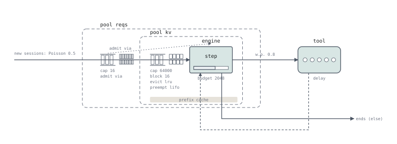

# 5. The engine

Replace the per-turn service time with an engine. Each iteration
allocates a token budget across the requests it is running and then admits waiting
requests with the remaining budget. This model allows prefill and decode
to share an iteration.

## The program

```serq title="docs/tutorial/programs/05-engine.sq"
--8<-- "docs/tutorial/programs/05-engine.sq"
```

Its deployment, drawn by [`serq draw`](../visualization/index.md):



## The engine on its device

The `stage engine` of chapters 3 and 4 is now an `engine`, and `engine` is
the word that declares one, so the engine is named `llm`.

```serq
device gpu {
  compute (t) = t * alpha;
  hbm (k) = omega + beta * k;
  kv cap blocks * bs;
}
engine llm on gpu {
  reqs cap max_seqs;
  tokens cap B;
  schedule {
    advance running;
    admit waiting while (running.preempted == 0);
  }
  execute (max(hbm(batch.kv_decode + batch.kv_prefill), compute(batch.tokens)));
}
pool kv on gpu { block bs; evict lru; preempt lifo; }
pool reqs on llm { queue fifo; }
```

The `device` says what the hardware offers: the time to compute `t`
tokens, the time to read `k` tokens of KV, and the KV capacity. The
`engine` says what runs on it. `reqs cap` is how many requests may run at
once (`max_num_seqs`), `tokens cap` the tokens one iteration may schedule
(`max_num_batched_tokens`). `schedule` is what each iteration does: give
the running requests their tokens, then admit waiting ones while nothing
was preempted. `execute` is how long the iteration takes, as an
expression in what it scheduled:

| Value | Meaning |
|---|---|
| `batch.tokens` | tokens scheduled this iteration |
| `batch.decoding` | decoding requests scheduled |
| `batch.prefilled` | prefill tokens scheduled |
| `batch.kv_decode`, `batch.kv_prefill` | memory held by the scheduled decode / prefill requests |
| `batch.attention` | attention work of the prefill chunks, \(\sum n(K + n/2)\) |

The cost is the larger of the time to read weights and KV memory and the
time to compute the scheduled tokens. Fit these parameters to measurements
of the engine you want to model.

`pool kv on gpu` is the device's memory, with its rules: blocks, eviction,
preemption. `pool reqs on llm` holds the engine's `reqs cap`: its running
slots, and the queue of requests waiting for one, served `fifo`. `each at most (c)` limits each request's prefill in an
iteration, and `advance running` takes an order and an `only`; see
[Engines on devices](../language.md#engines-on-devices).

## The workload and the server

The `session` inside `workload` describes the conversation: each `turn;`
waits for a response before the client decides whether to continue. The `server`
block describes how each request is served. The deployment figure shows
the server side.

## Three new pieces of the server

```serq
set hitmax = floor((prompt - 1) / bs) * bs;
hold reqs (cost(reqs, 1)), kv (cost(kv, min(prompt, hit + budget_left(llm))))
     at admission (hit = min(cachedin(kv), hitmax)) {
  set c = min(cached, floor((prompt - 1) / bs) * bs);
  run llm prefill (cost(llm, prompt - c)) growing kv;
  run llm decode (cost(llm, o - 1)) growing kv;
} cache (cost(reqs, kv, prompt + o));
```

**`growing kv`** allocates additional blocks as the request advances instead
of reserving its full memory at admission. With `preempt lifo`, a failed
growth can preempt the most recently admitted running request. The hold is
retried; see [preemption semantics](../language.md) for the state preserved
across retries.

**`budget_left(llm)`** is the token budget left after serving the running requests.
The admission reserves memory for the cached prefix plus the prefill chunk
that fits this budget, capped by `prompt`.

The header reads both the cache and the budget at admission. A prefix may
be evicted while the request waits, so reading the cache earlier in a `set`
would use an outdated value. `at admission (hit = …)` names this value for
the header.

**`pool reqs on llm`** hands the pool's queue to the engine's
scheduler: waiting requests are admitted by `admit waiting` in an
iteration, with the budget left, and never in an iteration that preempted.

## Running it

```bash
serq run docs/tutorial/programs/05-engine.sq --horizon 20000 --warmup 2000 --seed 1
```

```text
run: horizon 20000 end 20000 warmup 2000 seed 1 events 9210071 arrivals 9905 ended 8905 turns 44301 mean live 6.006

observe   count    mean   95% CI    cv2     p99
--------  -----  ------  -------  -----  ------
hit       44301  0.7938  ±0.0032  0.260  1.0000
ttft      44301  0.0182  ±0.0005  1.274  0.0798
response  44301  0.0629  ±0.0009  0.638  0.2370

stage  number   util   done    thru    wait  service    iters
-----  ------  -----  -----  ------  ------  -------  -------
llm     0.153  0.138  88602  4.9223  0.0000   0.0311  9160680
tool    5.851  0.997  35398  1.9666  0.0000   2.9755        0

step  prefill only  decode only  mixed   idle  decodes  decode batch  decode step   itl p50   itl p99
----  ------------  -----------  -----  -----  -------  ------------  -----------  --------  --------
llm          0.036        0.096  0.006  0.862    0.110         1.079     0.000223  0.000209  0.000240

pool   used   cached  queue  holders    wait  admits  evict(n)  evict(u)  preempt  spill  rej  stuck
----  -----  -------  -----  -------  ------  ------  --------  --------  -------  -----  ---  -----
kv    735.9  28664.1  0.000    0.153     NaN   49390       258   1935856        0      0    0      0
reqs    0.2      0.0  0.002    0.153  0.0007   49390         0         0        0      0    0      0
```

`done 88602` at `llm` against 44 301 turns — two runs per turn, prefill
and decode.

TTFT is now separately observable, and at 18 ms it is a different quantity from
the 63 ms response. Iteration-level simulation lets the program measure both.

!!! note "`wait NaN` on the `kv` pool"
    A hold on several pools joins the queue of the **first** one, so `kv` never
    has a queue of its own and has no queue-wait samples. Read the wait on `reqs`.

---

Next: turn the load up. → [The cliff](06-the-cliff.md)
