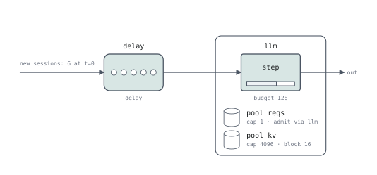

# vllm-ascend

Reference: [v0.27.1rc1](https://github.com/vllm-project/vllm-ascend/tree/v0.27.1rc1), a release candidate. Its [release notes](https://github.com/vllm-project/vllm-ascend/releases/tag/v0.27.1rc1) specify upstream **vLLM v0.27.1**. This page considers full-attention request/KV paths; the selected scheduler depends on configuration.

## Tagged behavior

`ShortRequestFirstRequestQueue` classifies requests into immediate, short and long queues. Immediate requests take precedence; sufficiently old long requests are promoted ahead of short requests. This is a class-and-aging policy, not simply sorting by length. [Queue implementation][short]

`BatchJobAwareRequestQueue` uses job-level decode-length predictions, available admission budget, cold-start requests and length buckets. A fixed per-request key cannot reproduce its shared history. [Job-aware implementation][job]

In the relevant preemption path, `RecomputeScheduler.schedule` asks the connector to offload. Success proceeds to normal preemption; failure finishes the local request through `_finish_recomputed_request` and returns `stop_reason="recomputed"`. `DyntraLBPolicyMixin` also prefetches remote KV and waits in `WAITING_FOR_REMOTE_KVS`. [Recovery][recompute], [prefetch][dyntra]

## Device inputs and padding

`_pad_for_sequence_parallelism` rounds scheduled tokens to a TP-size multiple
when the relevant SP path is enabled. `_determine_batch_execution_and_padding`
then selects a graph descriptor and checks uniform decode from per-request
scheduled lengths and computed state. With DP, metadata synchronization can
pad ranks to a common maximum and redispatch the graph mode. Explicit eager
execution returns a non-graph descriptor; graph eligibility is separate from
logical admission. These are conditional paths, not a universal NPU rule.
[SP and graph selection](https://github.com/vllm-project/vllm-ascend/blob/v0.27.1rc1/vllm_ascend/worker/model_runner_v1.py#L3069),
[DP coordination](https://github.com/vllm-project/vllm-ascend/blob/v0.27.1rc1/vllm_ascend/worker/model_runner_v1.py#L724)

The FIA TND input requires the final query-length boundary to equal the
hidden-state token dimension. Padding can therefore insert a dummy request,
not merely extend a flat tensor. The full-attention builder also pads sequence
length and block-table metadata to that dummy row; dummy outputs are trimmed
and KV writes use only actual tokens.
[Query boundaries](https://github.com/vllm-project/vllm-ascend/blob/v0.27.1rc1/vllm_ascend/worker/model_runner_v1.py#L914),
[metadata consistency](https://github.com/vllm-project/vllm-ascend/blob/v0.27.1rc1/vllm_ascend/attention/attention_v1.py#L348)

A single-rank cost can round `tokens` without changing request progress.
Cross-rank graph agreement and per-request boundary validation require more
than aggregate cost terms. The current example does not model graph capture
or padded device buffers. See [input shapes](input-shapes.md).

## Executable serQ approximation



```serq title="examples/vendors/ascend.sq"
--8<-- "examples/vendors/ascend.sq"
```

This example reevaluates immediate/aged-long/short/long precedence before each admission selection, using `waited` for elapsed queue time and FIFO ties. Its six requests are selected in order `0, 4, 1, 5, 2, 3`; disabling aging with `max_wait = 0` produces `0, 4, 2, 3, 1, 5`. Request slots, KV capacity, token budget and chunk size are explicit; prompt and output capacity is allocated upfront to avoid recovery in this example.

## Remaining gaps

| Requirement | Current mechanism | Remaining gap |
|---|---|---|
| Waiting-lane selection | Selection-time `queue by` and `waited` model FCFS class precedence and aging | Priority-lane configuration and lane-specific prepend behavior |
| Job prediction and cold start | Session attributes | Shared job history and completion-driven predictor updates |
| Remote KV arrival | `lease`, `load`, `release`, explicit transfer | Connector success/failure, cancellation and readiness protocol |
| Offload or remote recompute | `preempt lifo`, `computed`-aware local recovery | Choose a recovery target and finish/forward to another engine |

Aging changes selection at an
admission attempt; it does not schedule an independent wakeup timer. Shared
job history and connector behavior remain outside this example.

The current IR can retain source memory through a transfer and preserve a local request's known progress on re-admission. Those mechanisms do not by themselves implement Ascend's connector or routing policy.

## Validation

this reduced example links and completes its six requests. It has not been compared request by request with the Ascend scheduler or runtime.


[short]: https://github.com/vllm-project/vllm-ascend/blob/v0.27.1rc1/vllm_ascend/core/short_request_first_scheduler.py#L148
[job]: https://github.com/vllm-project/vllm-ascend/blob/v0.27.1rc1/vllm_ascend/core/batch_job_aware_scheduler.py#L372
[recompute]: https://github.com/vllm-project/vllm-ascend/blob/v0.27.1rc1/vllm_ascend/core/recompute_scheduler.py#L415
[dyntra]: https://github.com/vllm-project/vllm-ascend/blob/v0.27.1rc1/vllm_ascend/core/dyntra_lb_scheduler.py#L169
