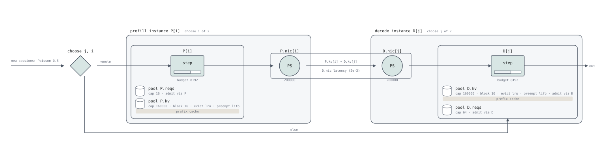

# Prefill/decode disaggregation over NIXL

`examples/pd-disaggregation/llmd_nixl_pull.sq` models routing, prefill,
KV transfer and decode on separate instances. Its key coupling is a lease:
finished prefill blocks remain allocated until the decoder can receive them.
Decoder memory pressure can therefore retain memory on the prefiller.

The source correspondence uses llm-d `8a2f37d`, its inference scheduler
`13eebdb`, and vLLM `0c87a197` (`ref/vllm`). This is a reduced simulation
model, without a two-scheduler differential oracle or hardware validation.



The router picks a prefill instance and a decode instance, each a box with
its engine, its NIC and its pools. The read crosses between them: it holds
the prefiller's NIC and the decoder's at once, which is the bracket around
`P.nic[i]` and `D.nic[j]`, and moves the prompt's KV from the
prefiller's leased blocks to the decoder's (`P.kv[i] → D.kv[j]`) after the
decoder's read latency.

## Configuration

The example has two prefill instances and two decode instances, block size
16, separate KV and request-slot pools, and a NIC per instance. Costs and
capacities are illustrative; this is not the llm-d guide's gpt-oss-120b
hardware configuration.

## In serQ

```serq title="examples/pd-disaggregation/llmd_nixl_pull.sq"
--8<-- "examples/pd-disaggregation/llmd_nixl_pull.sq"
```

### Routing

The gateway selects a decoder by `holders + queued`, then compares its
uncached prompt suffix with `thr`. For remote prefill, it selects a prefiller
with a cached prefix first, then by load. It runs the prefill entry before
the decode entry. The router reads the model's actual cache state rather
than a delayed or approximate cache index.

The model uses `thr = 1` for always-remote prefill and larger thresholds to
keep short uncached suffixes on the decoder. The server's `max_model_len`
check and the gateway's output cap limit request length.

### Scheduler correspondence

| vLLM | serQ | Where |
|---|---|---|
| a prompt of `max_model_len` tokens or more is refused before it is scheduled; a generation stops at `max_model_len` tokens; no KV cache smaller than one request of `max_model_len` is started | `branch (K + n < max_model_len) { gw.route(); } else { set more = 0; }` in `server`; `set o = min(o, max_model_len - prompt)` in the route; `max_model_len = 16384` below every pool | `input_processor.py:512-536`; `sched/utils.py:114-120`; `kv_cache_utils.py:864-900`, called at `kv_cache_utils.py:2742` |
| the prefiller admits like any vLLM engine: a slot, the blocks of the first chunk, room for the whole prompt, the prefix hit looked up when the scheduler takes the request | `hold reqs (cost(reqs, 1)), kv (cost(kv, min(prompt, hit + budget_left(P)))) reserve (cost(kv, prompt)) at admission (hit = …)` in `P`'s `prefill` entry | the waiting loop, `scheduler.py:868-1128`; [the vLLM use case](vllm.md) |
| the prefiller computes the prompt in chunks and samples one token, which the sidecar discards | `run P prefill (cost(P, prompt - c)) growing kv` | `scheduler.py:624-823`; the truncation for Mamba and MTP only, `nixl/base_scheduler.py:409-436` |
| the request finishes on the prefiller: its slot is freed, its blocks are not — `request_finished` returns `delay_free_blocks` and a lease of `kv_lease_duration` (30 s), renewed by the decoder's heartbeats while the request waits | `} cache (prompt) lease kv (inf);` — the scope ends, the slot goes, the blocks stay the session's | `nixl/pull_scheduler.py:191-292`; `_free_request`, `scheduler.py:2628-2657`; the renewal, `nixl/base_scheduler.py:199-238`, `nixl/base_worker.py:3010-3030` |
| the prefiller keeps every computed full block of the prompt cached once the lease ends | `cache (prompt)` on that hold, applied when the lease ends | `_connector_finished`, `scheduler.py:2929-2982`; `kv_cache_manager.py:610-619` |
| the decoder's scheduler looks at its waiting queue only at a step with budget left and a running slot free | `admit via D` on both of the decoder's pools; `reqs (0) reserve (1)` — a slot must be free, none is taken | `scheduler.py:872-879` |
| the decoder's local prefix hit, then the connector: for a remote prefill every prompt token beyond the local hit is external and loaded asynchronously | `kv (known) reserve (known)` with `reuse (reusable(known, bs))` in `D`'s `decode … from` entry; `c = cached` is the local hit | `scheduler.py:932-954`; `nixl/pull_scheduler.py:34-66` |
| blocks are allocated for the whole prompt, and the request is parked, `WAITING_FOR_REMOTE_KVS`, holding them and no slot; one transfer per request | the hold on `kv`; `transferred` is `do_remote_prefill`, spent | `scheduler.py:1199-1226, 1264-1294`; `nixl/pull_scheduler.py:108-189` |
| the worker reads the blocks from the prefiller over NIXL (pull mode: a NIXL READ issued by the decoder) | `transfer (prompt - c) from src to kv (prompt - 1 - c)` in `D`'s entry, and `D pull P latency x0 share maxmin;`: the decoder reads; a fixed wait, then the bytes out of the prefiller's NIC and into the decoder's at once, the two shared max-min fairly (a model, not a measurement: [Bandwidth sharing](https://github.com/servingQ/serQ/blob/main/docs/design/bandwidth-sharing.md)) | `nixl/pull_scheduler.py:168-177`; the worker's `_read_blocks`, `nixl/pull_worker.py:392-575` |
| the read done, the blocks are cached, the last prompt token is marked uncomputed (its logits are needed), and the request is back in the waiting queue, served before new arrivals | the `load D.kv[j] (cost(D.kv, prompt - 1 - c))` the transfer stands for; `hold reqs (cost(reqs, 1))`, with `reqs` declared before `kv` | `_update_waiting_for_remote_kv`, `scheduler.py:3032-3077`; `_try_promote_blocked_waiting_request`, `scheduler.py:3079-3092`; `scheduler.py:2383-2385` |
| the prefiller frees the leased blocks when the read completes | the `release P.kv[i]` the transfer stands for takes the lease | `_update_from_kv_xfer_finished`, `scheduler.py:3113-3138` |
| the decoder recomputes the last prompt token and decodes; a request preempted afterwards is rescheduled without a second transfer, prefilling locally what it lost | `run D prefill (cost(D, known - c)) growing kv; run D decode (cost(D, o - 1 - (known - prompt))) growing kv;` with `known` from `computed` | `scheduler.py:1560-1561`; `nixl/pull_scheduler.py:187-189` |
| a parked request is in no `running` list and is not preempted; nor is the prefiller's finished one | `preempt lifo` takes the last admitted *resident* of the engine | `scheduler.py:742-813` |
| the decoder keeps the prompt's and the output's full blocks cached | `} cache (prompt + o)` | `kv_cache_manager.py:602-606` |

### Writing xPyD

The deployment is queues: `NP` prefill instances and `ND` decode instances,
each with its own KV pool, request-slot pool, engine and NIC, and one
gateway selected by `gw.route();` in the server.

```
queue gw : gateway { route { … } }                 // the router and the sidecar
queue P[NP] : prefill { pool reqs { … admit via P; } pool kv { … } serve step { … memory kv; } nic ps(BwP); prefill (prompt) { … } }
queue D[ND] : decode  { pool reqs { … admit via D; } pool kv { … admit via D; } serve step { … memory kv; } nic ps(BwD); decode (prompt) { … } decode (prompt) from src { … } }
D pull P latency x0 share maxmin;                  // the decoder reads the KV from the prefiller
stage tool : delay;
```

A queue's pools are its members': `P[i].kv` is the KV of the i-th
prefiller, `admit via P` inside `P` means the member's own scheduler serves
the pool, and `memory kv` on its stage counts the member's own blocks as its
residents' memory (`kv_decode`, `kv_prefill`). The family's size is the
`let` the router chooses over (`queue D[ND]`, `choose j in ND`), so the
number is written once. Each pod's NIC is its own (`nic ps(BwD);`, the
stage `D.nic`), and `D pull P latency x0 share maxmin;` is the transfer's
topology and mode in one line: the decoder reads the KV from the
prefiller, waits `x0` before each read, and concurrent reads divide the two
NICs max-min fairly.

The router is the gateway's two `choose`s, and the instance it picked is
the queue the request is handed to: `P[i].prefill (prompt)`, then
`D[j].decode (prompt) from P[i]`. Inside an entry nothing is indexed — `kv`,
`reqs`, `P` are the member's own. `from P[i]` is the pool `P`'s entry
leases, and the read's NICs are the relation's: the source member's
`P.nic[i]` and the reader's own `D.nic[j]`. The transfer's `load` and
`release` name the pool as the holds did, index included. The admission, the
allocation and the two runs are the entries' and appear once each: the
router's body has no `hold`.

Change `NP` and `ND` in the source to change the instance counts. The
router and queue entries use these family sizes directly.

### Pull and push

The pull example dispatches the prefill and decode entries serially. The
prefiller leaves a lease; the decoder allocates its destination and reads
across both NICs. `transfer` accounts for link work, loads the destination's
computed KV, and releases the source lease.

The [push example](https://github.com/servingQ/serQ/blob/main/examples/pd-disaggregation/vllm_nixl_push.sq)
uses `fork { P[i].prefill (prompt); }` and joins before transfer. Decoder
allocation can proceed while prefill runs, matching the concurrent dispatch
in vLLM's push proxy (`disagg_proxy_pushconnector_demo.py:227-270`). The
write waits for both prefill completion and destination registration
(`nixl/push_scheduler.py:128-205`, `nixl/push_scheduler.py:207-294`). Under
decoder pressure, both models retain the source lease until destination
memory is available.

### Limits

- Leases use `inf`: expiry, heartbeats and failure recovery are not modeled.
  vLLM grants and tracks a bounded lease (`nixl/pull_scheduler.py:248-269`)
  and extends it with heartbeats (`nixl/base_worker.py:3010-3030`).
- Transfers do not model bidirectional KV reuse between turns, accelerator
  host buffers or tensor-parallel fan-out.
- Prefix caches are per session, without cross-session content sharing.
- The router reads exact model state; stale or approximate routing metadata
  is not represented.
- Max-min NIC sharing and fixed read latency are modeling assumptions.

## Run the example

```bash
serq run examples/pd-disaggregation/llmd_nixl_pull.sq --horizon 2000 --warmup 200 --seed 1 --json
```

At the defaults (seed 1, horizon 2 000 s, warm-up 200 s), the run gives:

| Metric | Result |
|---|---|
| Remote-prefill fraction | 59.8% |
| Mean TTFT | 28.8 ms |
| Mean response | 71.3 ms |
| Mean source lease | 13.4 ms |
| Rejected / stuck sessions | 0 / 0 |

These are simulation observations, not hardware measurements or intervals
across seeds. The lease includes waiting for decoder capacity and the
transfer. Use `--dump` to inspect per-request observations.

!!! warning "Fractional lengths limit this example"
    The workload draws fractional token lengths. Near `max_model_len`, its
    output cap can leave less than one token, while the request body
    subtracts one for the first token. The run then rejects a negative
    decode amount. Seed 1 with `--horizon 10000 --warmup 1000` reaches this
    error; long-run comparisons from this example are not validated.

## Validation

The vLLM correspondence is checked against the pinned source by
`scripts/check_citations.py`. `tests/pd_semantics.rs` checks lease lifetime,
release, load, transfer and the coupling between decoder capacity and
prefiller occupancy. These are deterministic tests of the interpreter's
semantics, not differential checks against two real vLLM schedulers.
