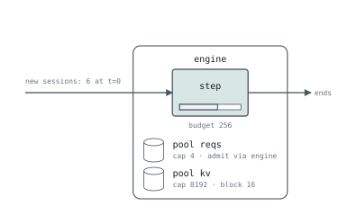

# vllm-rbln

The latest tag checked on 2026-09-30 is [v0.11.3a21](https://github.com/rebellions-sw/vllm-rbln/tree/v0.11.3a21), an alpha. Its [dependency](https://github.com/rebellions-sw/vllm-rbln/blob/v0.11.3a21/pyproject.toml#L41) is **vLLM 0.26.0+cpu**; the plugin's version is separate. Only the native `RBLNScheduler` and `RBLNKVCacheManager` full-attention paths are considered.

## Tagged behavior

`RBLNScheduler.schedule` constrains a batch to decodes or a lone prefill. Accepting a waiting prefill can discard an already selected decode batch. `DecodeBatchBudget` separates a PP-dependent hard cap from a soft cap based on current demand. [Selection][native], [decode budget][budget]

The waiting path calls `allocate_slots` with `full_sequence_must_fit=True`: admission tests whether the current full sequence fits even when the allocation is only for the next chunk. Admission capacity and actual allocation are different quantities. [Scheduler][native]

Sub-block caching finds a prefix inside a larger physical block and creates copy operations into another block. `apply_sub_block_match` transfers source references to the copy operations; `release_copy_ops` releases them. Lookup granularity, allocation granularity and copy lifetime must remain separate. [Cache manager][subblock]

## Compiled inputs and padding

The native runner compiles decode shapes up to the PP-stage ceiling
`max_num_seqs // pipeline_parallel_size`, then rounds active decode requests
up to the smallest configured bucket. Buckets may be linear, exponential or
manual; a missing covering bucket is an error, not an arbitrary new shape.
[Runner bucket configuration](https://github.com/rebellions-sw/vllm-rbln/blob/v0.11.3a21/vllm_rbln/v1/worker/rbln_model_runner.py#L479),
[bucket lookup](https://github.com/rebellions-sw/vllm-rbln/blob/v0.11.3a21/vllm_rbln/v1/worker/bucketing/bucketing_manager.py#L63)

For text inputs the runner stages a lone prefill with query dimension
`max_num_tokens`, even when its actual chunk is shorter. Decode uses padded
request rows and the step's uniform query length. `InputStager` fills dummy
rows/positions and copies only the actual rectangle. Padding changes device
work and buffers; it must not become extra generated/computed request tokens.
[Input layout](https://github.com/rebellions-sw/vllm-rbln/blob/v0.11.3a21/vllm_rbln/v1/worker/rbln_model_runner.py#L1297),
[staging](https://github.com/rebellions-sw/vllm-rbln/blob/v0.11.3a21/vllm_rbln/v1/worker/input_stager.py#L71)

`determine_batch_execution_and_padding` requires a uniform query length
(`num_tokens % num_reqs == 0`). Its specialized DP path can force decoding
peers to the top bucket and prefill token dimension when another rank
prefills. This applies even with ordinary one-token full-attention decode;
local phase isolation does not remove cross-rank shape coordination.
[Shape routes](https://github.com/rebellions-sw/vllm-rbln/blob/v0.11.3a21/vllm_rbln/v1/worker/dp_utils.py#L135)

For a local non-speculative model, a cost expression can charge fixed
prefill width or bucketed `decoders` while the logical work stays unchanged.
The current example uses illustrative costs and does not emulate these
compiled shapes. See [input shapes](input-shapes.md) for executable cost
expressions and the remaining IR requirements.

## Executable serQ approximation



```serq title="examples/vendors/rbln.sq"
--8<-- "examples/vendors/rbln.sq"
```

`serve exclusive prefill` selects either one prefill or a decode-only batch.
A fitting waiting prefill can replace tentative resident decodes and use the
full token budget. Cancelled decode work does not advance computed KV; its
already acquired allocation stays held. A selected prefill stops further
waiting admission. Ordinary capacity, budget-exhaustion and preemption gates
still apply. [PR #171](https://github.com/servingQ/serQ/pull/171) implemented this
policy in the current interpreter; see the [phase-isolation contract](../design/exclusive-prefill.md)
for the regression scenarios and exact limits.

`reserve (known)` tests the current sequence's capacity (the prompt, or what a resumed request had computed), while the hold allocates
only the initial chunk and `growing kv` extends it as computation advances.
The live token budget is bound at admission, rather than captured before
queuing.

The native scheduler keeps vLLM's prefix cache and preemption. A waiting
request looks up its prefix hit ([`get_computed_blocks`][hit]), the step's
blocks are cached once scheduling is final ([`cache_blocks`][cached]), and a
failed allocation preempts the last running request under FCFS
([`running.pop()`][preempt]). The program says the same for a session's own
prefix, with the hit bound at admission, `cache (prompt + out)` and `preempt
lifo` on `kv`. `RBLNScheduler` hands a preemption to upstream vLLM
([`_preempt_request`][resume]), which keeps the generated tokens and drops
their KV, so a resumed request prefills from what it had computed (`known`,
as `lib/vllm.sq` cites). In this workload neither fires: the six requests
are separate sessions, and serQ's cache is keyed by session where vLLM's is
shared by content hash, so none hits another's prefix; four slots of at most
272 tokens never fill 8192 tokens (512 blocks) of KV.

The example covers local phase isolation. PP caps, remote-KV decode-ready
admission guards and sub-block copy semantics remain outside it. The hand-derived
interpreter regressions do not establish native scheduler equivalence.

## Remaining gaps

| Requirement | Needed refinement |
|---|---|
| PP hard/soft decode caps | Per-request selection and batch constraints, separate from resident slot count |
| Sub-block hit and copy | Independent lookup/allocation units and source/destination objects with copy leases |

Reducing `block` to the sub-block size would also reduce physical allocation. It can match hit counts while predicting the wrong memory pressure.

## Oracle scenarios

Compare waiting prefill arriving during resident decode; PP hard/soft cap divergence; and a partial-block prefix match requiring a copy. Include source eviction and cancellation while copying. Observe final selected batch, computed/committed progress, physical block count and copy reference acquisition/release.

**Validation:** this reduced example links and completes its six requests.
All 44 iteration assignments were checked to contain either a lone prefill
or decodes only. The interpreter policy also has six hand-derived regression
tests. No native RBLN differential test has been run.


[native]: https://github.com/rebellions-sw/vllm-rbln/blob/v0.11.3a21/vllm_rbln/v1/core/rbln_scheduler.py#L180
[budget]: https://github.com/rebellions-sw/vllm-rbln/blob/v0.11.3a21/vllm_rbln/v1/core/utils.py#L178
[subblock]: https://github.com/rebellions-sw/vllm-rbln/blob/v0.11.3a21/vllm_rbln/v1/core/rbln_kv_cache_manager.py#L468
[hit]: https://github.com/rebellions-sw/vllm-rbln/blob/v0.11.3a21/vllm_rbln/v1/core/rbln_scheduler.py#L535
[cached]: https://github.com/rebellions-sw/vllm-rbln/blob/v0.11.3a21/vllm_rbln/v1/core/rbln_scheduler.py#L917
[preempt]: https://github.com/rebellions-sw/vllm-rbln/blob/v0.11.3a21/vllm_rbln/v1/core/rbln_scheduler.py#L380
[resume]: https://github.com/rebellions-sw/vllm-rbln/blob/v0.11.3a21/vllm_rbln/v1/core/rbln_scheduler.py#L1026
