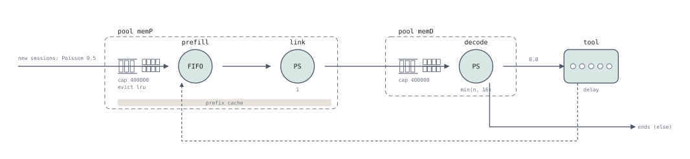

# The deployment view

`--view deployment`, the default: the program as a queueing network.

That is `programs/lecture_pd.seq`, and it is `fig:deployment` of Lecture 1 §2
— generated.

## The flow is projected from the session program

Pools and stages are declared; the arrows are not. `deployment::project`
walks the session program carrying a hold stack:

| | |
|---|---|
| **Nodes** | one per stage a `Run` reaches. A stage array is one node labelled `[N]` |
| **Edges** | the successor relation on `Run`s in session order, threaded through `Branch` (both arms) and `Loop` (a back edge to the body's first station) |
| **Enclosure** | every `Run` is tagged with the `Hold`s around it; stations sharing a hold on pool `p` sit inside `p`'s dashed box — **the lecture's "instance" boundary** |
| **Edge labels** | a `Branch` guard, printed by `Program::show_expr` |
| **Ends** | `CArrival` labels the in-arrow, `End` the out-arrow |

Three things the walk deliberately does *not* do:

- **Two runs at the same stage in a row** are two visits, not a flow between
  stations. `vllm.seq` prefills and decodes at one engine; there is no arrow.
- **A chain of guards that moves nobody** collapses to one edge.
  `routing.seq`'s five sibling `branch (policy == k)` blocks would otherwise
  multiply out to 68 edges with labels like `else, 0 == 0, 0 == 1, …`.
- **A `choose` annotates the station it selects** — the one whose reference
  reads the attribute it names, `rep[j]`, not whatever station comes next.

## Glyphs

| IR | Glyph |
|---|---|
| `Fifo(c)` | circle, `FIFO`, the server count when `c ≠ 1` |
| `Ps(φ)` | circle, `PS`, with `φ` beneath |
| `Delay` | rounded box of small circles — infinitely many servers |
| `Step { … }` | rounded box with a token-budget bar. The lecture has no glyph for this: the colocated engine is the one stage kind it could not express |
| a pool enclosing a station | dashed rounded box, options stacked in the column at its left |
| finite `cap` | a slot grid — `cap` cells when `cap ≤ 32`, schematic above that. `kv` at 160 000 is not 160 000 squares |
| a pool a hold caches in | a grey strip along the bottom of its box |
| the pool's queue | the queue glyph ahead of the box |
| `admit via S` | a dashed edge from the queue to `S` |

A pool's eviction order is drawn only where something is cached in it: an order
over an empty cache says nothing.

### Which pool holds the cache

This follows `sim.rs::release_hold` rather than the syntax: a hold with a
`growing` run caches in **that pool alone**, and one without caches in **all**
of its pools. `programs/replica.seq` is the case that makes the difference
visible — its `hold batch (1), kv (…)` has no `growing`, and the run really
does keep about 7 units of `batch` cached.

## Nesting

`replica.seq` holds `live` across the whole program including the tool call, and
`batch` and `kv` only around the engine. The boxes nest accordingly, and the
`tool` station sits inside `live` and outside the other two.

## Against the lecture's figure

`tests/draw.rs::lecture_pd_has_the_topology_of_fig_deployment` asserts the
station kinds, the enclosures, the cache strip on `memP` only, and the
`decode → tool → prefill` feedback path. It is the one acceptance test in this
feature with an independently hand-drawn answer key.

Four differences are expected:

1. **Geometry.** The lecture places the tool call below centre by hand; the
   generated layout puts feedback edges in lanes below the station row.
2. **`link` moves inside the prefill box.** The figure draws it outside both
   dashed boxes; the program holds `memP` across the transfer, and so does the
   lecture's own listing, where `run link X` stands between `admit mem_P c`
   and `free mem_P cache κT`. The caption concedes the point: *"The figure is
   a picture, not a definition: it does not say when a waiting request is
   admitted, what happens to its KV memory afterwards, or who decides a
   hit."* A figure read out of the holds says all three.
3. **`step` needs a glyph** the lecture has none for.
4. **Cost labels are the real expressions** — `min(n, 16)` where the lecture
   writes `φ(m)`, since the IR holds the folded expression and not the symbol.

## A program that holds nothing

`routing.seq` has no pools at all. There are no boxes, and that is the honest
rendering: a program that holds nothing has nothing for the enclosure notation
to say. The `choose j of 4` under `rep[j]` is the routing policy.
