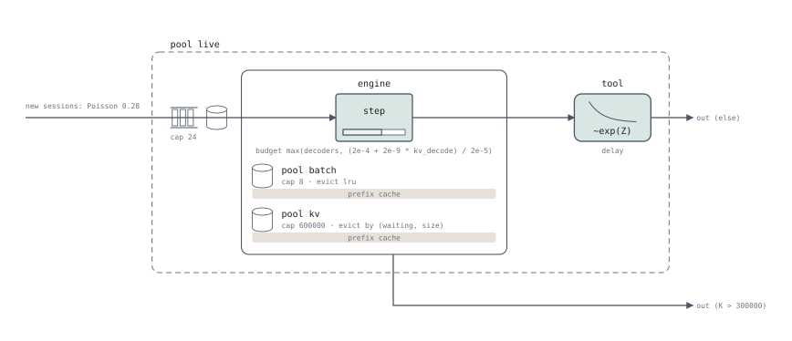
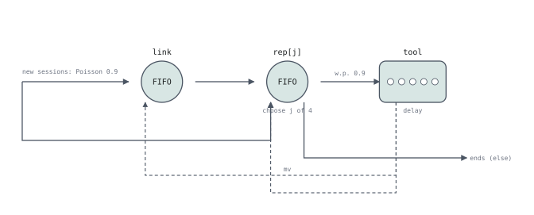

# The deployment view

The program as a queueing network.

That is `examples/pd-disaggregation/llmd_nixl_pull.sq`: two prefill and two decode
instances, the KV read over NIXL. Each filled panel is an instance: what the
router's `choose` picks, a pod with its engine, its NIC and its pools; the
engine's slots and KV blocks are drawn in the engine's frame. The
read crosses from the prefiller's box to the decoder's: it holds the
prefiller's NIC and the decoder's at once, so its two stations are bracketed
as one job, and what it moves (`P.kv[i] → D.kv[j]`: the prefiller's blocks
stay leased until it ends, the decoder's are allocated before it starts) and
the link's latency are written on it.

## The flow is projected from the session program

Pools and stages are declared; the arrows are not. `deployment::project`
walks the session program carrying a hold stack:

| | |
|---|---|
| **Nodes** | one per stage a `Run` reaches (`Node::stage` is `Some`); a stage array is one node labelled `[N]`. A loop that decides before its first station adds a decision ◇, a node with no stage (`Node::stage` is `None`, `kind` is `Decision`) |
| **Edges** | the successor relation on `Run`s in session order, threaded through `Branch` (both arms) and `Loop` (a body that decides before its first station - several first stations, or an `end` before any - starts at a decision ◇, named by the `choose`s it makes, which every turn comes back to and which an `end` before any station leaves from; any other body is walked twice, so its last stations lead back to the station it starts at). An arrow forward past other stations, and an entry past the first, run in a lane below the row rather than through them |
| **Instance** | a `choose v` is a pick of an instance: the stages and pools the session then indexes by exactly `v` (`P[i]`, `P.nic[i]`, `P.kv[i]`) are one, drawn in a solid box named after its step engine (`prefill instance P[i]` when it only prefills). A choice of one station and nothing else is no box |
| **Enclosure** | every `Run` is tagged with the `Hold`s around it; stations sharing a hold on pool `p` sit inside `p`'s dashed box. Inside an instance's box only its own pools are drawn, and none at the stations of a run between two instances: the run's arrow says what it moves |
| **Frame** | A pool held at one station alone - every hold that takes it there reaches no other station - is that station's: the station is drawn in an unfilled frame with a row per such pool under its glyph, and no dashed box. An instance is a filled panel, so a frame inside one reads as the station's, not the pod's. A transfer between instances does not count: it holds the sender's pool and the receiver's, and its arrow says so (`P.kv[i] → D.kv[j]`), so each KV is its engine's |
| **Latency** | a link's `serve … latency` (a delay stage `L.latency` run before every transfer over `L`) is written on the transfer, not drawn as a station, when it waits before one transfer; before several (down two arms) it stays a station, which keeps each arm's way in to its own transfer |
| **Edge labels** | a `Branch` guard, printed by `Program::show_expr` |
| **Ends** | `CArrival` labels the in-arrow, `End` the out-arrow |

Three things the walk deliberately does *not* do:

- **Two runs at the same stage in a row** are two visits, not a flow between
  stations. `vllm.sq` prefills and decodes at one engine; there is no arrow
  (below).
- **A chain of guards that moves nobody** collapses to one edge.
  `routing.sq`'s five sibling `branch (policy == k)` blocks would otherwise
  multiply out to 68 edges with labels like `else, 0 == 0, 0 == 1, …`.
- **A `choose` annotates the station it selects** — the one whose reference
  reads the attribute it names, `rep[j]`, not whatever station comes next.

That is `examples/multi-turn/vllm.sq`. Its request slot (`reqs`) and its
KV blocks (`kv`) are held only at `engine`, so they are drawn in its frame.
The dashed arrow back to `engine` is the next turn, after the tool call.

## Glyphs

| IR | Glyph |
|---|---|
| `Fifo(c)` | circle, `FIFO`, the server count when `c ≠ 1` |
| `Ps(φ)` | circle, `PS`, with `φ` beneath |
| `Delay` | rounded box with the shape of its duration's density - decaying for `~exp` and `~h2`, a hump for `~erlang`, flat for `~uniform`, a spike for `~det` or a constant - and the duration as written under it (`~exp(3)`). A duration that is no distribution, or too long to fit, gets the lecture's row of small circles: infinitely many servers |
| `Step { … }` | rounded box with a token-budget bar: an iterating engine, not a queueing station |
| a pool | a drum, its capacity and options written beside it (`cap 8192 · block 16`) |
| a pool held at one station alone | a row in the station's unfilled frame, under its glyph: drum, name, options |
| a pool held across several stations | dashed rounded box, the drum and options in the column at its left |
| a pool a hold caches in | a grey strip under its row, or along the bottom of its box |
| the queue a hold waits in | ahead of a dashed box, one per hold rather than per pool: a hold of several pools joins the queue of its first (`interp.rs` `enqueue_hold`). A frame draws none: its pools are taken at its entrance |
| `admit via S` | `admit via S` among the pool's options; from a dashed box, also a dashed edge from the queue to `S` |

A pool's eviction order is drawn only where something is cached in it: an order
over an empty cache says nothing.

### Which pool holds the cache

This follows `interp.rs::release_hold` rather than the syntax: a hold with a
`growing` run caches in **that pool alone**, and one without caches in **all**
of its pools. `examples/multi-turn/replica.sq` is the case that makes the difference
visible — its `hold batch (1), kv (…)` has no `growing`, and the run really
does keep about 7 units of `batch` cached.

## Nesting

`replica.sq` holds `live` across the whole program including the tool call, and
`batch` and `kv` only around the engine. `live` is a dashed box around both
stations; `batch` and `kv` are rows in `engine`'s frame, and `tool` is
outside them.

## A program that holds nothing

`routing.sq` has no pools at all. There are no boxes, and that is the honest
rendering: a program that holds nothing has nothing for the enclosure notation
to say. The `choose j of 4` under `rep[j]` is the routing policy.
