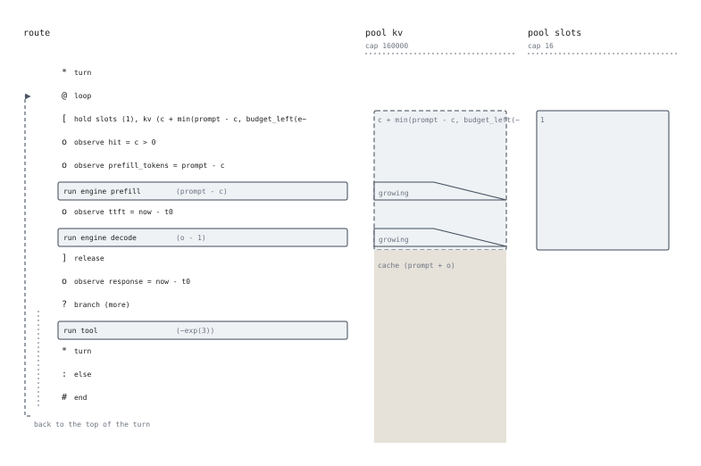

# The route view

`--view route`: one session's path, with every statement kept.

## Why it is not a flowchart

The deployment view quotients the route to its stages. This one keeps
everything, and its subject is the thing a node-and-arrow diagram cannot show:
`hold` is a **scope**.

So a hold is drawn as a **band** — a region of a pool's column occupied over a
span of the route — and the units a scope leaves cached are a **tail** that
outlives the band. In `vllm.seq` that tail crosses the bottom of the `loop` and
is consumed at the top of the next turn by `c = min(cachedin(kv), …)`:

> **The loop's back edge and the cache tail are the same arrow.**

That is the feedback of [chapter 6](../tutorial/06-the-cliff.md), and in the
source it is spread over a `cache` clause, a `loop` keyword and a `cachedin`
call forty lines apart.

## Widths are nominal; edges are not

Vertical is position in the route, not time. Band widths are **not to scale** —
a single session's allocation against a pool of 160 000 units would be
invisible, and magnitude is not what this view is for.

What the geometry carries is *when a width is decided*:

| Mark | Meaning |
|---|---|
| **solid** band edge | the width is a number after linking — the constants fix it |
| **dashed** band edge | the width is evaluated **at admission** |
| widening **wedge** | a `growing` run enlarges the hold as it proceeds |
| light outer outline | `fits (r)`: what must be free to be admitted, against what is allocated |
| **faded** tail | `cache (ℓ)`: units that stay after the scope ends |
| a rule across the column | `drop POOL` cuts the tail |

In the figure above, `hold slots (1), kv (c + min(prompt - c, budget_left(engine)))`
gives one band of each kind, side by side. That difference is a real one in the
semantics — unit expressions are evaluated at admission, not when the session
queues — and it is the rule a reader of the source is most likely to miss.

The distinction costs nothing to compute: the IR folds `let` constants, so a
width that the constants fix is literally a number in the tree.

## The spine

| Glyph | Statement |
|---|---|
| `*` | `turn` |
| `o` | `observe` |
| `[` `]` | a hold opening and releasing |
| a box | `run` |
| `?` `:` | `branch` and its `else` |
| `@` | `loop`, with the rail down the left |
| `<` | `choose` |
| `x` | `drop` |
| `#` | `end` |

`set` statements are computation rather than resource movement, and are off by
default — `routing.seq` has fifteen and they would bury the figure. `--show-set`
includes them.

`observe` points **are** drawn. Where `ttft` is taken relative to the hold is
the information: in the figure above it sits between the prefill run and the
decode run, inside the band, which is the definition of the quantity.

## Reading the vLLM route

Three things the figure states that the 50 lines of source do not:

1. **`slots` and `kv` are held together, for exactly the same span.** The
   admission is atomic over both; the request cap and the blocks are checked
   as one thing, which is what vLLM does.
2. **The `kv` band widens twice** — once during prefill and once during
   decode. Both runs carry `growing kv`; the request is admitted with the
   blocks for the chunk it can run now and grows from there.
3. **The tail runs past `end`.** There is no `drop kv`, so a finished session's
   prefix stays in the pool. That is not an omission: vLLM keeps a finished
   request's blocks in the free queue, and the program models it by not
   dropping.
